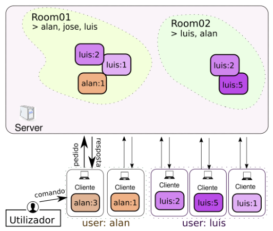

# IoTDevice
[](https://github.com/shodanwashere/IoTDevice/actions/workflows/main.yml)
## Overview
This project implements an IoT system with a client-server architecture demonstrated in the diagram below.
An IoT **client** is a program - the `iot-device` program - that represents a sensorial device. This program is responsible for sending sensory data to the server. This program is controlled only by one user, and has a unique identifier (e.g., `alan` controls devices `alan:3` and `alan:1`).



For an `iot-device` to publish data to the server, the user must first authenticate with the server. To access the data on the server, we have the concept of "Domain". Devices can be part of one or more work domains (e.g., device `luis:2` is registered in the `Room01` and `Room02` domains). This way, a user with read access in a given domain can access the data generated by any device in that domain (e.g., `luis` is registered in the `Room01` and `Room02` domains, so, he can read the data of the 4 devices registered in them).

`iot-device` has two main functionalities:
1. Send (two types of) data to the server: images and temperature values;
2. Access temperature data and/or images of a given device.
To make use of these functionalities, `iot-device` implements a simple command line, for user interaction.

The **server** application, `iot-server`, is a program that allows multiple clients to connect simultaneously, maintains information about registered devices, domains and users, authenticates and identifies users and collects and shares information received by various clients in an organized and persistent way.

## Building
This project uses Maven to build and is implemented using aggregation (multi-modules). Building is fairly simple:

```
$ mvn compile && mvn package
```

Once that is done, you will find the project's jar files inside the `target` directory.

## Using
### `iot-server`

```
$ java -jar iot-server-1.0.jar [port]
```
Where:
- `[port]` is the TCP port used to accept client connections. If a value is not specified, the server will use port 12345 and accept connections on any interface.

### `iot-device`

```
$ java -jar iot-device-1.0.jar <serverAddress> <dev-id> <user-id>
```
Where:
- `<serverAddress>` is the server's IP address following the schema `<ip/hostname>[:port]`. The IP/hostname of the server is mandatory, while the port is optional. By default, the client will connect on port 12345 on the remote server.
- `<dev-id>` is an integer that identifies the device.
- `<user-id>` is a string that identifies the (email address of the) local user
